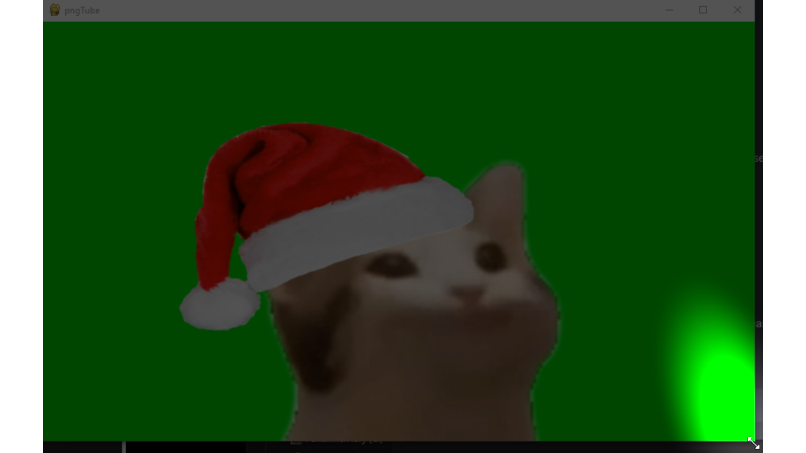

# 2D-pngTube

Streamaus-palveluissa käytetään maksullisia 2D/3D-avatareja, jotta omilla kasvoilla ei tarvitse esiintyä. Näiden avatarien luonti ja riggaaminen on haastavaa/kallista.

Tuttavani pyysi minua luomaan hänelle yksinkertaisen 2D-avatarin alustavaksi ratkaisuksi tietyillä specseillä, ja minä toteutin.

Projektia voisi seuraavaksi jatkaa lisäämällä taustalle moduulin, joka seuraa puhujan kasvoja (silmiä, nenää), ja kääntää avataria sen mukaisesti.

---

# 1. Aja pngTube.exe

# 2. Ohjelmisto kysyy kansion, missä kuvia säilytetään (muistaa ensikerralla .cfg tiedoston ansiosta)

* Kansiossa olevat kuvat pitää olla nimettynä ..._00000.png, ..._00001.png jne. metodilla (katso mallikansio)

* 950 x 560 resoluutio on toimiva

# 3. Seuraavaksi tulee asettaa käytetty äänilaite

* Tartu ikkunan oikeaan alalaitaan ja venytä --> Näppäimet on piilotettu kuvan ulkopuolelle (kuva alla)

# 4. Oikealla ylhäällä (alla kuva) on laitteen valinnan nappula (ohjelma muistaa valinnan)

* Oikealla alhaalla on äänenvoimakkuuden mittari

* Vasemmalta alhaalta voit säätää herkkyyttä (ohjelma muistaa valinnan)

#  5. Lopuksi suosittelen käynnistämään ohjelman uudelleen, jotta ikkunan saa palautettua vanhaan kokoonsa.

# 6. Jos tahdot nollata asetukset/valita uuden avatarin, nopein tapa on poistaa .cfg tiedosto kansiosta.
